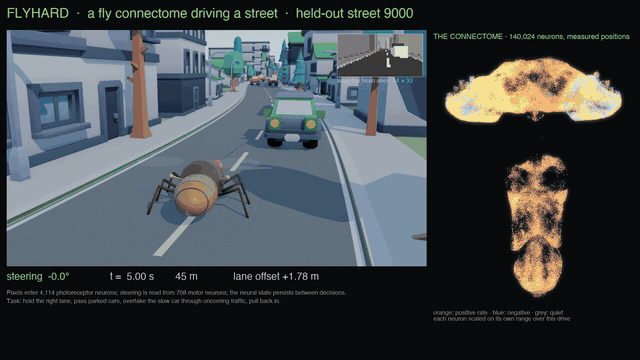
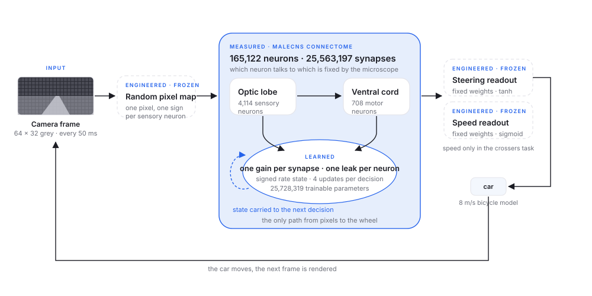

# Fly Self Driving

**A fruit fly's brain, driving a street.** The measured wiring diagram of a fruit fly, 165,122 neurons and 25,563,197 synapses from the [MaleCNS](https://male-cns.janelia.org/download/) connectome, run as a recurrent network and trained to steer from a 64 × 32 pixel windscreen. On streets it never trained on, with parked cars, oncoming traffic and a slow car to overtake, it completes **58 of 60** across three independent sets, with no collisions with any car.

<p align="center">
  <a href="https://fly-self-driving.kylon.app"></a><br>
  <sub>Held-out street 9000. Left: the replay. Top right: what the brain actually sees. Right: all 140,024 positioned neurons, each lit by its own recorded activity. <a href="https://fly-self-driving.kylon.app">Watch the full drive</a>.</sub>
</p>

Everything in the video is replayed from recorded state: the fly and every car follow their logged positions, the inset is the real input, and the brain panel is the real activity. The failures are on the site too.

## How it works

<p align="center">
  
</p>

- **Measured:** which neuron connects to which. Every traced neuron is a unit with a signed rate state, every measured connection is an edge, and the adjacency never changes.
- **Learned:** one gain per synapse and one leak per neuron, 25,728,319 parameters, all constrained to the fly's wiring.
- **Engineered and frozen:** a random map from pixels onto the 4,114 optic-lobe sensory neurons, a random readout from the 708 ventral-cord motor neurons to the steering angle, the car, and the street. Nothing engineered can carry the signal on its own.
- **State carried.** Four graph updates per 50 ms decision, and the network is never reset between decisions. The original recipe wipes the state every decision; a real fly never resets. This one change took the same graph from 3 of 20 roads to 17 of 20 on the first task.

Full description: [docs/method.md](docs/method.md). Interactive version: [How does it work](https://fly-self-driving.kylon.app/how-it-works).

## Training recipe

Imitation first, then its own mistakes. A pure-pursuit expert that reads the true state drives 60 training streets with noise injected into its steering; the connectome is fit to the expert's commands by truncated backpropagation over 16-decision windows (1,200 updates); then three rounds of DAgger let the brain drive while the expert relabels every state it actually reaches (3 × 500 updates). About 35 minutes on one H100. Evaluation is closed loop on three independent sets of 20 unseen streets, against a linear map, a small MLP, and the same graph with its connections shuffled at random.

| Model | With traffic | No traffic |
| --- | --- | --- |
| Expert (pure pursuit, reads the true state) | 20 / 20 | 20 / 20 |
| Linear map, pixels to steering, 1,153 parameters | 12 / 20 | 20 / 20 |
| MLP, one hidden layer of 40, 46k parameters | 18 / 20 | 20 / 20 |
| Fly connectome, behaviour cloning only | 12 / 20 | 20 / 20 |
| **Fly connectome + DAgger ×3, window 16** | **20 · 19 · 19 / 20** | 20 · 20 · 19 |
| Same recipe, randomly rewired graph | 16 / 20 | 18 / 20 |

The data recipe, every hyperparameter, the speed-control task with pedestrians and dogs, and the caveats (the fly does not brake yet; one training seed per condition) are in [docs/method.md](docs/method.md) and [docs/results.md](docs/results.md), and on the site under [Training recipe](https://fly-self-driving.kylon.app/training-recipe).

## Train your own

```bash
# 1. the original experiment as a sibling directory; its scripts fetch and verify the MaleCNS data
git clone https://github.com/MarkUnthank/flyhard ../flyhard
cd ../flyhard && python -m venv .venv && .venv/bin/pip install -e . && \
  .venv/bin/python scripts/acquire_connectome.py && .venv/bin/python scripts/prepare_graph.py && cd -
# expected: ../flyhard/data/graph-traced-v1/graph.npz with sha256 eff4093b…

# 2. this repository, plus the patches (Apple-silicon GPU kernel and a 2.5x faster CUDA backward)
python -m venv .venv && .venv/bin/pip install -r requirements.txt
cp flyhard-patches/connectome.py ../flyhard/src/flyhard/connectome.py
cp flyhard-patches/connectome_mps.py ../flyhard/src/flyhard/connectome_mps.py

# 3. train the street driver: cloning, then DAgger, then the rewired control and the baselines
cd tasks/street
python train_street.py --model connectome --graph-mode measured --demo-steps 320 --overtake-weight 3 \
    --window 16 --batch 4 --steps 1200 --lr 0.04 --out runs/street-measured
python train_street.py --model connectome --graph-mode measured --demo-steps 320 --overtake-weight 3 \
    --init runs/street-measured/checkpoint.pt --steps 0 --dagger-rounds 3 --dagger-steps 500 --out runs/street-measured-dagger
python train_street.py --model connectome --graph-mode shuffled --demo-steps 320 --overtake-weight 3 \
    --window 16 --batch 4 --steps 1200 --lr 0.04 --out runs/street-shuffled
python train_street.py --model linear --lr 0.001 --demo-steps 320 --device cpu --out runs/street-linear
python train_street.py --model mlp --hidden 40 --lr 0.001 --demo-steps 320 --device cpu --out runs/street-mlp40

# 4. record a held-out street and render it
python record_episode.py --checkpoint runs/street-measured-dagger/checkpoint.pt --seed 9000 --steps 500 --out episodes/ep-9000
cd ../../render && ./fetch_assets.sh && ./render_best.sh ../tasks/street/episodes drive 9000
```

The scripts find the flyhard checkout as a sibling of this repository, or wherever `FLYHARD_ROOT` points. On Apple silicon, run one GPU job at a time.

## Repository layout

| Path | What it is |
| --- | --- |
| `flyhard-patches/` | Drop-in files for a flyhard checkout: the Apple-silicon (MPS) kernel for the sparse connectome core, a CUDA backward that caches the transposed graph, and the scripts used to reproduce the original steering-wheel pilot. |
| `tasks/flat-road/` | The first driving task: curving road, obstacles, 48 × 24 camera. Trainer, batched evaluator, linear and MLP baselines. |
| `tasks/street/` | The street task: two lanes, buildings, parked cars, oncoming traffic, a slow car to overtake. Environment, expert, trainer with DAgger, evaluator, recorder. |
| `render/` | The replay renderer: rebuilds a recorded episode in Blender with [Kenney](https://kenney.nl) CC0 kits and a procedural fly, and composites the real input and the recorded neural activity into the final video. |
| `results/` | Metrics from every run reported on the site, plus two recorded episodes of the best model as examples of the state-log format. |
| `docs/` | [Method](docs/method.md) and [results with controls and caveats](docs/results.md). |

Not included: the connectome data (about 1 GB, fetched by flyhard's scripts), trained checkpoints (about 600 MB each), Kenney assets (`render/fetch_assets.sh`), and the rendered videos (on the [site](https://fly-self-driving.kylon.app)).

## Credits

Built in September 2026 by agents working in a [Kylon](https://kylon.io) workspace, for under $25 of GPU time.

- [flyhard](https://github.com/MarkUnthank/flyhard) by Mark Unthank (MIT): the connectome-as-network recipe and the wheel pilot we reproduced first.
- [MaleCNS](https://male-cns.janelia.org/download/) (Janelia): the connectome.
- [NeuroMechFly / FlyGym](https://github.com/NeLy-EPFL/flygym): the fly body used in the wheel pilot.
- [DAgger](https://arxiv.org/abs/1011.0686), Ross, Gordon and Bagnell, 2011.
- [Kenney](https://kenney.nl) (CC0) for the game kits; [Blender](https://www.blender.org) renders them.

License: MIT (see LICENSE). Third-party materials keep their own terms.
